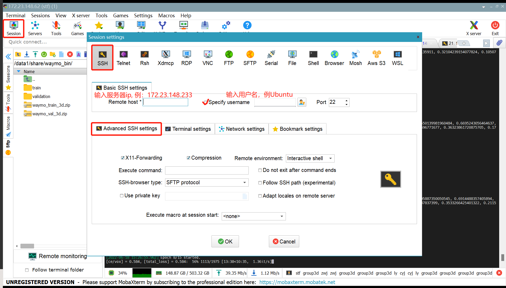

# DMCV服务器使用指南

本指南适用于Windows10\11与MAC系统，校外使用服务器需要步骤1。

## 1. 登录学校VPN

前置条件：已经入学，拥有学号（尚未入学可找老师借）

进入学校VPN官网https://docs.ecnu.edu.cn/vpn/下载Easy Connect，查看登录教程文档

这里推荐Open Connect而不使用Cisco的Easy Connect
下载网址：https://github.com/openconnect/openconnect-gui
步骤：点击右侧Releases的Latest下载最新版本，Windows下载-win32.exe，Mac下载high_sierra版本，其余登录方式与学校VPN官网文档一致

## 2. 下载MobaXterm并登录服务器

Windows系统推荐使用MobaXterm登录服务器

1、进入https://mobaxterm.mobatek.net/download.html下载免费版MobaXterm，安装到任意位置

2、打开MobaXterm，依次点击左上角Session，SSH，Advanced SSH settings按钮

3、配置ssh-key，因为服务器只支持密钥对登录。根据[教程](https://blog.csdn.net/u013778905/article/details/83501204)提供步骤生成密钥对（推荐使用GitHub管理密钥对），将github用户名与公钥字符串(id_rsa.pub)文件中的内容发给有管理员权限的师兄师姐，待师兄师姐配置完毕，勾选上图中Use private key，在后面的路径栏中输入对应私钥路径。

4、为其他人创建用户、添加密钥

1）创建用户：`useradd -m -s /bin/bash <创建的用户名>`

2）`vim /home/<创建的用户名>/.ssh/known_hosts`复制公钥字符串(id_rsa.pub)内容

3）当自己可以登录目前账户时，可以使用`ssh-import-id-gh <github用户名>`来直接更新登录服务器的公钥与登录github的一致

## 3. GPU环境搭建

    
1、更改自己用户密码：`passwd <用户名>`

2、确保网络连接成功，在后续报网络错误时及时找学长学姐

3、创建miniconda虚拟环境：
下载地址：https://docs.conda.io/en/latest/miniconda.html
下载Linux installers中的Miniconda3 Linux 64-bit，右键点击，选择复制链接地址
1）linux本地下载：`wget <链接地址>`（或者下载到本地，参考4.GPU大文件传输方式传输至服务器）

2）执行安装命令：`bash <Miniconda3_xxxxx.sh>`

3）执行初始化命令：`conda init`

4）创建conda虚拟环境（实际写代码时用）：参考[博客](https://blog.csdn.net/qq_41754907/article/details/121562755)

5）下载pytorch等包（实际写代码时用）：
`nvidia-smi`查看本机cuda版本，https://pytorch.org/ 官网中选择对应操作系统和版本，获得对应安装命令，其它需要的包可以采用pip或conda的方式安装

4、磁盘管理：为了避免随着用户增多，`/home`目录下磁盘空间越来越小，需要将代码、数据集等文件放在其它磁盘下，通过软链接（windows中的快捷方式）的形式链接到home目录下

1）`df -h` 观察本机磁盘状况，选择容量较大，空余较多的磁盘所在的挂载目录

2）以外盘目录为`/media/`为例，本人用户名为`abc`，创建目录名为`data`

    cd /media
    mkdir data
    ln -s ./data /home/abc/  # (ln -s <source目录> <target目录>)
若没有创建权限，需要有sudo权限的学长学姐帮忙创建

3）为其他人创建目录并更改权限

    sudo mkdir <目录名>
    sudo chown -R <目录新的拥有者> <目录名>

## 4. GPU大文件传输

可以使用[FileZilla](https://filezilla-project.org/)或FlashFXP（需要找盗版，比较简洁），选择SSH登录，使用密钥，与MobaXterm类似
